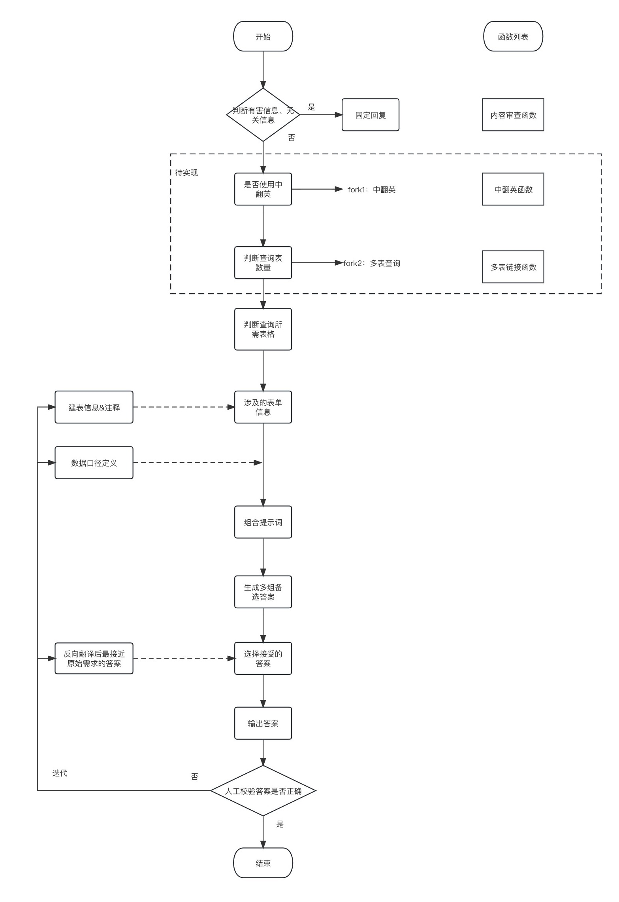

<h1 align="center">SQLBot</h1>

  <h3>一个基于大语言模型的SQL学习和工作平台</h3>
  

    <a href="https://"><strong>视频介绍</strong></a>
  ||
    <a href="https://huggingface.co/spaces/kkAIGC/SQLBot"><strong>在线体验</strong></a>  

如果觉得 SQLBot 对您有帮助的话，请帮忙在
的右上角点个⭐ Star 和 Fork，谢谢

## 视频介绍
(视频录制中)

## 目录
- [简介](#简介)
- [特性简介](#特性简介)
- [方案流程](#方案流程)
- [库表举例](#库表举例)
- [Forkers](#Forkers)
- [联系我们](#联系我们)
- [致谢](#致谢)

## 简介
&emsp; &emsp;SQLBot是一款基于GPT技术的智能SQL编写助手，旨在提升数据分析师的工作效率，同时也让业务人员能够更便捷地进行数据提取。我们深知编写长篇SQL代码的复杂性和耗时性，因此我们设计了SQLBot，以帮助您更高效地处理这些任务。

## 特性简介
- 支持自然语言转SQL、可自定义库表信息，并提供多轮对话能力
- 支持SQL转自然语言、以及详细解释说明SQL
- 支持特定模板生成SQL、提高数据分析师取数效率。
- 提高数据题库练习，通过练习题目，并和AI讨论，提高SQL能力
- 支持自定义参数设置

## 方案流程
SQLBot的流程结构，如下图所示

  

## 库表举例
下图是一个常见的库表结构举例

  

## Forkers

## 联系我们
请先 Star 和 Fork，谢谢~

  

## 致谢
感谢以下项目和课程给予的知识和灵感
- [DB-GPT-Hub](https://github.com/eosphoros-ai/DB-GPT-Hub)

  - eosphoros组织提出的专注于大模型Text-to-SQL微调的开源项目，包含了大模型下载、数据集预处理、LoRA和QLoRA等微调技术、模型预测、模型评估等步骤。

- [sqlcoder](https://github.com/defog-ai/sqlcoder)

  - Defog组织提出的先进的Text-to-SQL的大模型，表现亮眼，效果优于GPT3.5、wizardcoder和starcoder等，仅次于GPT4。

- [gradio](https://www.gradio.app/docs)
  - Gradio 是使用友好的 Web 界面演示机器学习模型的网站，任何人都可以在任何地方使用它。

- [deeplearning-ai](https://learn.deeplearning.ai/)
  -  DeepLearning.AI是一家专注于深度学习教育的在线学习平台。该网站由深度学习领域的知名专家Andrew Ng创立。提供了一系列的深度学习课程以及AI相关课程。

- [openai-cookbook](https://github.com/openai/openai-cookbook/blob/main/examples/Backtranslation_of_SQL_queries.py)
  - openai-cookbook是OpenAI官方提供的使用 OpenAI API 的示例和指南，本例子为反向翻译SQL为自然语言进行SQL选择。
